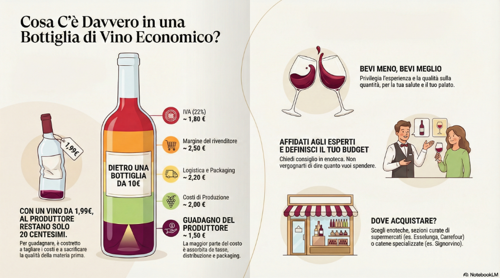

# I Migliori Vini Italiani 2026

### lanciare browser per testare con estensione
D:\chrome\Application\edge.exe --from-installer

## Panoramica Ricerca Enologica
Di seguito la selezione dei vini premiati e riconosciuti dalle principali guide italiane e internazionali per l'anno 2026. Questa lista rappresenta l'eccellenza della produzione vinicola nazionale.

### 🏆 I Campioni del 2025/2026

#### **Gambero Rosso - Vini d'Italia 2026 (Tre Bicchieri)**
Il riconoscimento più prestigioso del Gambero Rosso, assegnato a 508 etichette quest'anno.
*   **Rosso dell'Anno:** *Brunello di Montalcino 2020* - **Giodo** (Toscana)
*   **Bollicine dell'Anno:** *Franciacorta Brut Nature 2021* - **Bosio** (Lombardia)
*   **Rosato dell'Anno:** *Cerasuolo d'Abruzzo Baldovino 2024* - **Tenuta I Fauri** (Abruzzo)
*   **Bianco dell'Anno:** (In attesa di specifica, menzione d'onore per *Castelli di Jesi Verdicchio Cl. Ambrosia Ris. 2022* - Vignamato)
*   *Toscana Rosso IGT Montevertine 2022* (Le Pergole Torte) - **Montevertine** (Toscana)
*   *Brunello di Montalcino Montosoli 2020* - **Altesino** (Toscana)

#### **DoctorWine 2026**
*   **Vino Rosso dell'Anno:** *Vigneti delle Dolomiti San Leonardo 2020* - **San Leonardo** (Trentino)
    *   *Descrizione:* Un taglio bordolese di classe mondiale, simbolo di eleganza e longevità.

#### **Guida Winemag 2026**
*   **Miglior Vino Italiano:** *Barolo Docg Bussia Vigna dei Fantini 2021* - **Silvano Bolmida** (Piemonte)
    *   *Note:* Profondità, struttura e autenticità territoriale.

#### **Bibenda 2026 & 2025 (5 Grappoli)**
L'eccellenza secondo la Fondazione Italiana Sommelier (764 premiati).
*   *Barbera d'Asti Bricco dell'Uccellone 2022* - **Braida** (Piemonte)
*   *Altemasi Trentodoc Riserva Graal 2018* - **Cavit** (Trentino)
*   *Chardonnay Nama 2021* - **Nals Margreid** (Alto Adige)
*   *Cirò Rosso Ripe del Falco Riserva 2017* - **Ippolito 1845** (Calabria - Ed. 2025)

#### **Top 100 Vini e Vignaioli (Ferraro & Suckling)**
Vini con punteggio perfetto (100/100) per la qualità:
*   *Barbaresco Asili Riserva 2021* - **Bruno Giacosa** (Piemonte)
*   *Brunello di Montalcino Madonna del Piano Riserva 2019* - **Valdicava** (Toscana)
*   *Barolo Monvigliero 2021* - **G.B. Burlotto** (Piemonte)

#### **Selezione Internazionale 2026**
*   *Alphonse 2022* - **Domaine de Fontenille** (Luberon, Provenza)
    *   *Note:* Un rosso provenzale di grande carattere, con note di mora e spezie dolci. Elegante e profondo.

---

## 🛒 Vini da Supermercato / Smart Buy 2026

Una selezione di etichette reperibili nella Grande Distribuzione che garantiscono un eccellente rapporto qualità-prezzo anche nel 2026. Questi produttori mostrano una costanza qualitativa invidiabile.

> [!NOTE]
> I prezzi indicati sono stime di massima e possono variare in base al punto vendita e alle promozioni.

### Fascia €6 - €9

**Vini Bianchi**
*   **Colterenzio-Kaltern**: Tutti i Bianchi (Alto Adige) - *Garanzia di freschezza alpina.*
*   **Bucci**: Verdicchio dei Castelli di Jesi DOC (Marche) - *Un classico intramontabile, longevo e strutturato.*
*   **Librandi**: Cirò Bianco DOC (Calabria) - *Fresco, sapido, perfetto per il pesce.*
*   **Velenosi**: Passerina IGT (Marche)
*   **Feudi di San Gregorio**: Falanghina del Sannio DOC (Campania)
*   **Lungarotti**: “Torre di Giano” Bianco di Torgiano DOC (Umbria)
*   **Girlan**: “448 s.l.m.” Vigneti delle Dolomiti IGT (Alto Adige)
*   **Ca’ Maiol**: Lugana DOC (Lombardia)

**Vini Rossi**
*   **Colterenzio-Kaltern**: Lago di Caldaro DOC
*   **Fattoria dei Barbi**: Rosso dei Barbi Toscana IGT
*   **Prunotto**: “Fiulot” Barbera d’Asti DOCG - *La Barbera quotidiana per eccellenza.*
*   **Cantina Due Palme**: “Serre” Susumaniello Salento IGT
*   **Argiolas**: “Costera” Cannonau di Sardegna DOC - *Caldo e avvolgente.*
*   **Leone de Castris**: “Five Roses” Salento IGT (Rosato storico)

**Spumanti**
*   **Nino Franco**: Prosecco Superiore Valdobbiadene DOCG
*   **Bisol**: Prosecco Superiore Valdobbiadene DOCG
*   **Carpenè Malvolti**: Prosecco Superiore Valdobbiadene DOCG

### Fascia €10 - €15

**Vini Rossi**
*   **Banfi**: Rosso di Montalcino DOC - *Il "fratello minore" del Brunello, sempre affidabile.*
*   **Tormaresca**: Tutti i rossi (Puglia)
*   **Antinori**: “Pèppoli” Chianti Classico DOCG
*   **Marramiero**: Montepulciano d’Abruzzo DOC
*   **Di Majo Norante**: Tintilia del Molise DOC - *Autoctono da riscoprire.*
*   **Mazzei**: “Fonterutoli” Chianti Classico DOCG
*   **Cottanera**: “Barbazzale” Etna Rosso DOC
*   **Jacopo Biondi Santi**: “Sassoalloro” Toscana IGT

**Vini Bianchi**
*   **Ca’ dei Frati**: Lugana DOC - *Il riferimento per il Lugana.*
*   **Mesa**: Vermentino di Sardegna DOC
*   **Santadi**: “Cala Silente” Vermentino di Sardegna DOC
*   **San Michele Appiano**: Tutti i bianchi
*   **Abbazia di Novacella**: Tutti i bianchi - *Eleganza verticale.*

**Spumanti**
*   **Ferrari**: Trentodoc Rosé
*   **Altemasi**: Trentodoc Millesimato
*   **Donnafugata**: “Kabir” Moscato di Pantelleria DOC (Dolce)

### 🆕 GDO Selection 2026: Le Tre Categorie d'Oro

Ecco una suddivisione rapida per orientarsi tra gli scaffali, basata sulle segnalazioni 2026 (Berebene, Gambero Rosso, Altroconsumo).

#### 1. I Quotidiani (Sotto i 7€)
*Vini onesti, corretti e piacevoli per il pranzo di ogni giorno.*
*   **Illuminati**: "Riparosso" Montepulciano d'Abruzzo DOC - *Il re del rapporto qualità/prezzo.*
*   **Melini**: Chianti "San Lorenzo" DOCG - *Un classico toscano, morbido e beverino.*
*   **Sella & Mosca**: "La Cala" Vermentino di Sardegna DOC - *Freschezza marina imbattibile.*
*   **Vecchia Cantina di Montepulciano**: Rosso di Montepulciano DOC - *Il "baby" Nobile.*
*   **Di Sante**: Bianchello del Metauro "Gazza" DOC - *La white-choice alternativa e profumata.*
*   **Corvo**: "Glicine" (Sicilia) - *Bianco aromatico, semplice ma sempre efficace.*

#### 2. I Leoni (10€ - 18€)
*I grandi marchi che garantiscono qualità costante e fanno fare bella figura.*
*   **Michele Chiarlo**: "Le Orme" Barbera d'Asti Superiore DOCG - *Eleganza piemontese accessibile.*
*   **Masciarelli**: Montepulciano d'Abruzzo DOC (Linea Classica) - *Un'istituzione, intenso e complesso.*
*   **Masi**: "Campofiorin" Rosso del Veronese IGT - *Il "Supervenetian" originale, tecnica ripasso.*
*   **Donnafugata**: "Sedàra" (Rosso) o "Anthilia" (Bianco) - *L'etichetta artistica che conquista tutti.*
*   **Frescobaldi**: "Remole" o "Nipozzano" Chianti Rùfina Riserva - *Garanzia di storicità.*
*   **Feudi di San Gregorio**: Falanghina o Greco di Tufo - *I bianchi campani di riferimento.*

#### 3. Le Occasioni (Smart Buy 2026)
*Le gemme nascoste o i vini con prezzo/felicità altissimo.*
*   **Madonnabruna**: Falerio Pecorino "Maree" 2023 - *Premiato come Miglior Bianco qualità/prezzo 2025.*
*   **Casebianche**: "La Matta" Spumante Dosaggio Zero - *Il rifermentato in bottiglia divertente e naturale.*
*   **Notte Rossa**: Primitivo di Manduria - *Potenza pugliese a prezzi incredibilmente bassi.*
*   **Settesoli**: Linea monovarietale (Sicilia) - *Incredibile valore per vini territoriali e puliti.*
*   **Banfi**: "Centine" Toscana IGT - *Un piccolo Supertuscan a prezzo da GDO.*
*   **Coppo**: Tutti i vini top (Piemonte)
*   **Due Palme**: Selvarossa Riserva Salice Salentino DOC
*   **Ornellaia**: “Le Volte” Toscana IGT - *L'ingresso nel mondo dei Supertuscan.*
*   **Poliziano**: Nobile di Montepulciano DOCG
*   **Travaglini**: Gattinara DOCG
**Vini Bianchi & Spumanti Top**
*   **San Michele Appiano**: Linea “Sankt Valentin” - *Il vertice della cooperazione altoatesina.*
*   **Bisol / Bortolomiol / V8+ / Foss Marai**: Prosecco Superiore Cartizze DOCG
*   **Ferghettina / Barone Pizzini**: Franciacorta DOCG

### Bollicine d'Autore (Fascia €21 - €30)
*   **Ferrari**: “Perlé” Trentodoc (Trentino)
*   **Bellavista**: Franciacorta DOCG (Lombardia)
*   **Ca’ del Bosco**: Franciacorta DOCG (Lombardia)

---

## 🧐 Manuale: Come Scegliere il Vino al Supermercato
## 🛒 Articolo: Guida Definitiva all'Acquisto al Supermercato
*(Come scovare le perle nascoste ed evitare le trappole commerciali)*

Comprare vino al supermercato è diventata un'arte. La Grande Distribuzione Organizzata (GDO) offre oggi una selezione incredibile, ma nasconde insidie che possono rovinare una cena. Ecco i concetti chiave, distillati in una guida pratica per non sbagliare mai.

### 1. La Regola Aurea dell'Etichetta: "Imbottigliato all'Origine"
Non fidarti solo della sigla DOC o DOCG. La vera garanzia è una frase scritta in piccolo sul retro: **"Imbottigliato all'origine da..."** (o "Imbottigliato all'origine dalla Azienda Agricola...").
*   **Cosa significa?** Che chi ha coltivato l'uva è lo stesso soggetto che l'ha trasformata in vino e messa in bottiglia. La filiera è chiusa, controllata e identitaria.
*   **Cosa evitare?** Diciture vaghe come *"Imbottigliato da I.C.Q.R.F. IT-..."* senza il nome chiaro di una cantina. Spesso si tratta di vagoni di vino sfuso acquistati e imbottigliati industrialmente lontano dal luogo di produzione.

### 2. L'Equazione del Prezzo: Perché 5€ è il Limite Invalicabile
Molti pensano che un vino da 3€ sia un affare. Matematica alla mano, è impossibile.
*   **I Costi Fissi**: Togliendo IVA (22%), bottiglia di vetro, tappo, capsula, etichetta, cartone, trasporto e margine del supermercato, in una bottiglia da 3,00€ restano circa **30-40 centesimi per il vino**.
*   **La Conclusione**: A quel prezzo non stai bevendo frutto della terra, ma prodotti industriali lavorati al massimo risparmio.
*   **La Fascia Smart**: Tra i **7€ e i 15€** si trova il punto di equilibrio perfetto (Sweet Spot). Paghi la qualità, non il marketing di lusso, e spesso trovi le linee "base" di grandissimi produttori.

### 3. Psicologia dello Scaffale e "Cestoni"
Il supermercato è studiato per venderti ciò che vuole lui, non ciò che serve a te.
*   **No ai Cestoni**: Le bottiglie ammassate nei cestoni delle offerte ("Bin") sono "stressate". Subiscono urti, stanno in piedi (il tappo si secca) e prendono luce diretta.
*   **La Luce è Nemica**: I neon dei supermercati emettono radiazioni che degradano il vino (specie bianchi e rosati in vetro chiaro) in poche settimane ("Gusto di Luce").
*   **Il Trucco**: Allunga il braccio. Prendi sempre la bottiglia dalla **seconda o terza fila**, quella rimasta al buio e più protetta dagli sbalzi termici.

### 4. Il Tempo non Perdona (Sui Bianchi GDO)
I vini bianchi e rosati destinati alla GDO sono pensati per una beva immediata ("Ready to drink").
*   **La Regola**: Controlla sempre l'annata. Se siamo nel 2026, un bianco *base* del 2023 è probabilmente già "seduto" o ossidato. Cerca sempre l'annata corrente o, al massimo, la precedente per i vini più strutturati.
*   *Eccezione*: I grandi rossi (Barolo, Brunello, Chianti Riserva) che trovi nella vetrinetta chiusa a chiave; quelli possono e devono invecchiare.

---

---

## 🍷 Corso di Degustazione - Lezione 1
# L'Arte della Degustazione: Guida Completa all'Analisi Visiva e Olfattiva
*Dalla soggettività del gusto alla precisione del giudizio tecnico*

Chiunque si avvicini al mondo del vino deve compiere un passo mentale fondamentale: abbandonare momentaneamente il giudizio soggettivo ("mi piace/non mi piace") per abbracciare un giudizio **oggettivo**. Sebbene la scelta finale di acquisto rimanga personale, l'analisi sensoriale serve a stabilire tecnicamente se un vino è di qualità, se è integro e se rispetta le caratteristiche del suo territorio e vitigno.

Questo processo si articola attraverso l'uso di tre sensi: vista, olfatto e gusto. In questa guida esploreremo nel dettaglio le prime due fasi, fondamentali per preparare il cervello e il palato all'assaggio vero e proprio.

---

## PARTE 1: L'Analisi Visiva (Il Controllo Qualità)

L'esame visivo non è un semplice vezzo estetico, ma una vera e propria ispezione dello "stato di salute" del vino. Si valutano quattro parametri specifici, ognuno dei quali ci fornisce indizi preziosi sulla storia e sulla conservazione della bottiglia.

### 1. L'Effervescenza: La Firma degli Spumanti
Per i vini con le bollicine, l'analisi inizia immediatamente. Il "perlage" è il primo indicatore di qualità e si misura secondo tre criteri:
*   **Finezza:** Le bollicine devono essere piccole.
*   **Numero:** Devono essere numerose.
*   **Persistenza:** Devono risalire nel calice a lungo, senza svanire dopo pochi secondi.
Uno spumante con bollicine grossolane o che svaniscono subito è tecnicamente inferiore a uno che mostra un perlage fine e continuo.

### 2. La Limpidezza e la "Rivoluzione Naturale"
Secondo le regole classiche, un vino deve essere limpido e privo di particelle in sospensione osservandolo in controluce. Tuttavia, il panorama enologico moderno impone una distinzione cruciale. Con l'avvento della *nouvelle vague* dei **vini naturali e biodinamici**, molti produttori scelgono deliberatamente di non filtrare il vino per preservarne la materia e l'integrità. Di conseguenza, trovare una leggera velatura o torbidità in queste tipologie non è necessariamente un difetto, ma può essere una caratteristica stilistica di un vino di ottima qualità.

### 3. Il Colore: Cronologia ed Evoluzione
Il colore è l'aspetto più complesso dell'analisi visiva. Va esaminato inclinando il calice a **45 gradi su un fondo bianco** per valutarne intensità, vivacità e tonalità. Il colore ci racconta l'età del vino attraverso una scala cromatica precisa legata all'ossidazione:

*   **Vini Rossi:** L'evoluzione procede dal **rosso porpora** (gioventù), passando per il **rubino** e il **granato**, fino ad arrivare all'**aranciato** per i vini molto invecchiati.
*   **Vini Bianchi:** Si parte dal **bianco carta/platino** o **verdolino**, si passa al **paglierino** (il più comune), per poi evolvere verso il **dorato** e infine l'**ambrato**.
*   **Vini Rosati:** Variano dal rosa tenue e "buccia di cipolla" fino al rosa antico più carico.

**La Regola della Coerenza e le Eccezioni**
Il colore deve essere coerente con l'età della bottiglia. Un vino bianco dell'annata corrente non dovrebbe mai presentarsi dorato o ambrato; se lo fa, è probabile che abbia subito un'ossidazione precoce o una cattiva conservazione.
Tuttavia, esistono eccezioni fondamentali legate alla varietà dell'uva. Vitigni come il **Sangiovese** (Toscana, Romagna) e il **Nebbiolo** (Barolo, Barbaresco, Valtellina) tendono naturalmente a raggiungere le tonalità dell'invecchiamento (granato/aranciato) molto più velocemente rispetto ad altri vini come il Merlot o il Nero d'Avola. In questi casi specifici, un colore evoluto non è un difetto, ma una caratteristica varietale intrinseca.

### 4. La Fluidità
Infine, si osserva come il vino si muove nel bicchiere. La formazione di "archetti" sulle pareti del calice e la viscosità del liquido sono indicatori diretti del contenuto alcolico e della presenza di glicerina: un vino che scende in modo "sciropposo" o pesante suggerisce una struttura importante.

---

## PARTE 2: L'Analisi Olfattiva (La Complessità)

L'olfatto è il senso primordiale, l'unico collegato direttamente all'ipotalamo senza mediazioni, capace di evocare ricordi ed emozioni istantanee. Molti principianti si sentono frustrati perché "sentono solo odore di vino", ma è fondamentale sapere che gli aromi sono molecole reali (non additivi aggiunti) che possono essere riconosciute con l'allenamento.

### La Tecnica Corretta
Per analizzare i profumi senza errori, si segue un protocollo preciso:
1.  **Primo naso (calice fermo):** Si annusa brevemente per verificare l'assenza di difetti o "puzze" (odore di tappo, aceto, uova marce, straccio bagnato).
2.  **Rotazione:** Si fa ruotare il calice (tenendolo dallo stelo) per ossigenare il vino e sprigionare le molecole odorose.
3.  **Secondo naso:** Si annusa in profondità per cogliere il bouquet completo.

### Le Tre Famiglie di Aromi
Per decifrare ciò che sentiamo, dobbiamo categorizzare i profumi in base alla loro origine:
*   **Aromi Primari:** Sono i profumi propri dell'uva. Esistono vitigni "aromatici" che hanno profumi esplosivi e inconfondibili (Gewürztraminer, Moscato, Malvasia) e altri con note caratteristiche, come la banana tipica dello Chardonnay.
*   **Aromi Secondari:** Nascono durante la vinificazione e la fermentazione (note vinose, di lievito, di cantina).
*   **Aromi Terziari:** Sono i profumi dell'evoluzione, che si formano durante l'invecchiamento in botte o bottiglia. Includono le spezie, le note animali (cuoio), la tostatura (caffè, cacao), le note eteree (cera, smalto) e il cosiddetto sentore *boisé* (legno, tabacco).

### I Parametri di Qualità Olfattiva
Come si giudica se un profumo è "buono"? Non basta che sia forte. Si valutano quattro elementi distinti:
1.  **Intensità:** La potenza dell'impatto olfattivo.
2.  **Complessità:** È il parametro chiave per la qualità. Un vino è complesso quando sprigiona una molteplicità di aromi diversi che si evolvono nel calice. Più sentori riusciamo a descrivere, più il vino è considerato di alto livello.
3.  **Qualità/Eleganza:** L'armonia generale, l'equilibrio e la gradevolezza dei profumi, oltre alla loro franchezza (assenza di difetti).
4.  **Descrizione:** La capacità di dare un nome alle famiglie odorose riconosciute (floreale, fruttato, speziato, tostato, ecc.).

In conclusione, un vino di grande qualità non è solo quello che colpisce per la sua forza, ma quello che offre un racconto olfattivo complesso, pulito e in continua evoluzione grazie all'ossigenazione nel calice.

---

## 🍷 Corso di Degustazione - Lezione 2
# L'Alchimia e le Tecniche della Cantina: Dalla Vinificazione alla Bottiglia
*Guida tecnica ma leggibile ai processi di produzione e alle metodologie avanzate*

Se nelle lezioni precedenti abbiamo imparato a giudicare il vino con gli occhi e con il naso, ora è il momento di capire *come* quel liquido arriva nella bottiglia. Spesso si pensa che fare il vino sia semplicemente "spremere l'uva", ma la realtà è una complessa serie di scelte chimiche e meccaniche.

Il termine tecnico è **Vinificazione**: il processo che trasforma l'uva raccolta in vino. Il cuore pulsante di tutto questo sistema è la **fermentazione alcolica**, una reazione chimica che potremmo aver studiato alle elementari ma che qui assume un valore magico.

### 1. Il Motore di Tutto: La Fermentazione Alcolica
Al centro di ogni vinificazione c'è la **fermentazione alcolica**. È il processo chimico elementare in cui i lieviti (naturali o selezionati) mangiano gli zuccheri presenti nel mosto e li trasformano in **alcol etilico (etanolo)** e **anidride carbonica (CO2)**.
*   **Non solo alcol:** Questa reazione produce anche calore e decine di sottoprodotti secondari, tra cui piccole quantità di metanolo e anidride solforosa (solfiti), che sono quindi naturalmente presenti in ogni vino.
*   **Lieviti Selezionati:** Se non sono presenti le bucce (come nei bianchi) o per avere un controllo totale, si aggiungono lieviti selezionati. Attenzione però: l'uso di lieviti troppo "spinti" in laboratorio può creare aromi artificiali (come frutta tropicale esplosiva) che standardizzano il vino coprendo l'identità del vitigno.

### 2. Le Tre Vie della Vinificazione: Rosso, Bianco e Rosato
La differenza cromatica e strutturale dei vini dipende quasi esclusivamente dalla gestione delle **bucce**.

**A. Vinificazione in Rosso (Con Macerazione)**
L'obiettivo è estrarre colore, tannini e aromi.
1.  **Diraspatura:** Si toglie il raspo (la parte legnosa del grappolo) per evitare sapori amari e tannini troppo aggressivi.
2.  **Pigiatura e Macerazione:** L'uva viene pigiata e le bucce restano a contatto con il mosto durante la fermentazione. Funziona come una **"bustina del tè"**: più tempo le bucce restano immerse, più il vino diventerà scuro, tannico e strutturato.
3.  **Svinatura e Torchiatura:** Alla fine, si separa il vino fiore dalle parti solide. Le bucce vengono torchiate per estrarre l'ultimo liquido concentrato.

**B. Vinificazione in Bianco (Per Separazione)**
Qui la regola d'oro è l'assenza delle bucce.
1.  **Separazione Immediata:** Subito dopo la pigiatura, le bucce vengono rimosse. Non macerando, il vino non prende colore né tannini, mantenendo freschezza e acidità.
2.  **Il "Bianco da Uve Rosse":** È possibile fare vino bianco usando uva rossa (come il Pinot Nero in Champagne). Basta non far macerare le bucce: la polpa dell'uva è incolore.

**C. Vinificazione in Rosato (La Tecnica del Tempo)**
Si usano uve rosse poco pigmentate o si applica una **macerazione brevissima**. Le bucce restano a contatto col mosto solo per poche ore (la "bustina del tè" viene tolta subito), rilasciando solo un colore tenue (rosa) e pochissimi tannini.

### 3. La Creazione delle Bollicine (Spumantizzazione)
Esistono due strade maestre per la spumantizzazione naturale.

**Metodo Classico (Champenoise)**
Usato per Champagne e Franciacorta. È lungo e costoso.
*   **Rifermentazione in Bottiglia:** Al vino base si aggiunge sciroppo di zuccheri e lieviti e si imbottiglia. I lieviti creano le bollicine dentro la bottiglia chiusa.
*   **Lunga Attesa:** Il vino riposa sui lieviti per mesi o anni, acquisendo complessità (crosta di pane).

**Metodo Martinotti (Charmat)**
Usato per Prosecco e Asti.
*   **Autoclave:** La rifermentazione avviene in grandi vasche d'acciaio a pressione. È un processo veloce che preserva gli aromi primari di frutta e fiori dell'uva.

***

### In Sintesi
Che sia rosso, bianco, rosato o spumante, ogni vino è figlio di una decisione precisa sui tempi di contatto con la buccia e sulla gestione della fermentazione. La prossima volta che assaggiate, chiedetevi: "Quanto tempo è rimasta la bustina di tè in questa tazza?"

---

## �🍇 Tecniche di Produzione e Tipologie di Vino

Una guida essenziale alle principali tecniche di vinificazione e alle caratteristiche che ne derivano.

| Tipologia / Tecnica | Fase di Lavorazione | Caratteristiche Organolettiche | Esempi di Uve / Regioni | Dettagli Tecnici | Legno / Contenitori |
| :--- | :--- | :--- | :--- | :--- | :--- |
| **Vinificazione in Rosso** | Fermentazione con macerazione bucce, filtrazione, stabilizzazione. | Colore intenso (porpora-aranciato), tannini, aromi importanti. | Negroamaro, Sangiovese, Nebbiolo, Merlot, Nero d'Avola. | Macerazione variabile per estrarre colore. Zuccheri -> Alcol e CO2. | Vasche, botti grandi o barrique (invecchiamento 4-5 anni). |
| **Vinificazione in Bianco** | Spremitura, separazione immediata bucce, fermentazione. | Assenza tannini, colori da carta a dorato, freschezza. | Chardonnay, Pinot Nero (in bianco), Verdicchio. | Eliminazione bucce. A volte breve macerazione. | Acciaio (min 3 mesi), cemento, vetro o anfore. |
| **Vinificazione in Rosato** | Parziale macerazione bucce rosse (breve tempo). | Colori tenui (rosa tenue - antico), fresco, pochi tannini. | Negramaro, Gaglioppo, Nero d'Avola, Chiaretto. | Uve poco pigmentate. Vietato mix bianco/rosso (salvo eccezioni). | Acciaio, vetro o cemento. |
| **Macerazione Carbonica (Novello)** | Uve intere in contenitori stagni con CO2, fermentazione intracellulare. | Leggeri, fragranti, molto fruttati (frutta fresca), morbidi, bassa acidità. | Beaujolais Nouveau, Novello Italiano. | 2 settimane a T controllata. Aggiunta CO2. | Recipienti di acciaio. |
| **Metodo Classico (Champenois)** | Rifermentazione in bottiglia, affinamento lieviti, remuage, sboccatura. | Bolla fine, persistente, complessità, eleganza, struttura. | Champagne, Franciacorta, Cava, Crémant. | Presa di spuma 3-4 mesi, affinamento min 18 mesi (Franciacorta). 6 atm. | Bottiglia e pupitres. |
| **Metodo Martinotti-Charmat** | Rifermentazione in grandi contenitori a pressione. | Freschi, leggeri, fruttati, aromi varietali preservati. | Prosecco (Glera), Asti Spumante. | Processo breve (3-6 mesi). | Autoclavi di acciaio a pressione. |
| **Vini Passiti** | Appassimento uve (pianta/fruttaio), pigiatura, fermentazione lenta. | Concentrazione zuccherina/aromatica, corpo denso, morbidezza. | Passito Pantelleria, Vin Santo, Amarone, Sciacchetrà. | Disidratazione, resa bassa (25-30%), zuccheri fino 40%. | Piccole botti legno. |
| **Vini Liquorosi / Fortificati** | Aggiunta alcol/acquavite al vino base. | Alto grado alcolico (20-22°), complessità. | Marsala, Porto, Sherry, Madeira. | Fortificazione per stabilità e grado alcolico. | Botti di legno (spesso lunghi periodi). |
| **Vini Aromatizzati** | Aggiunta estratti erbe/spezie a vino base. | Note erbacee, amare, balsamiche. | Vermouth, Barolo Chinato, Retsina. | Artemisia, zucchero. | Variabile. |
| **Vini Botrytizzati (Muffa Nobile)** | Attacco Botrytis cinerea in vigna. | Note uniche, longevità, equilibrio dolcezza/acidità. | Sauternes, Tokaji. | Muffa avvizzisce grappolo e concentra zuccheri. | Tradizionalmente botti legno. |
| **Ice Wine (Eiswein)** | Vendemmia uve ghiacciate, spremitura a freddo. | Concentrati, dolci ma con spiccata freschezza. | Germania, Austria, Canada. | Vendemmia -7/-10°C. Acqua eliminata come ghiaccio. | Inerti o legno. |
| **Affinamento in Anfora** | Riposo in vasi terracotta. | Varietale puro, no cessioni legno, micro-ossigenazione. | Ribolla Gialla (Gravner), Vini Georgiani. | Materiale inerte traspirante. Spesso interrate. | Anfore terracotta/giare. |

---

## 📚 Glossario Vini e Prezzi (Dati 2026)

Database completo dei vini, tipologie e prezzi medi di riferimento (enoteca/web).

| Nome Vino / Tipologia | Tipo | Provenienza | Prezzo Rif. | Note e Caratteristiche |
| :--- | :--- | :--- | :--- | :--- |
| **Vino Novello** | Rosso | Italia | ~10 € | Prodotto con macerazione carbonica; deve avere note fruttate e morbide. (Evitare se < 5€). |
| **Sauternes** | Passito | Francia (Bordeaux) | 35 € - 500+ € | Ottenuto da uve botrytizzate (muffa nobile); longevità incredibile, abbinamento con foie gras. |
| **Ice Wine (Eiswein)** | Passito | Canada, Austria, Germania | 40 € - 100+ € | Uve vendemmiate ghicciate (-7/-10°C). Concentrazione estrema e freschezza. Molto costoso. |
| **Negroamaro** | Rosso | Puglia | 8 € - 18 € | Vino dal colore molto intenso; può essere utilizzato anche per produrre splendidi rosati. |
| **Chiaretto del Garda** | Rosato | Lago di Garda (Lombardia/Veneto) | 8 € - 15 € | Rosato con colore scarico e brillante, delicato e floreale. |
| **Sangiovese** | Rosso | Toscana, Emilia Romagna | 8 € - 25+ € | Vitigno principe italiano. Evolve verso granato/aranciato; tannino vibrante che richiede affinamento. |
| **Nebbiolo** | Rosso | Piemonte, Lombardia | 12 € - 30 € | Raggiunge velocemente tonalità aranciate; tannico, elegante, ideale per lunghi invecchiamenti. |
| **Barolo** | Rosso | Piemonte (Langhe) | 35 € - 100+ € | Il "Re dei Vini". 100% Nebbiolo. Richiede anni di affinamento per levigare i tannini potenti. |
| **Barbaresco** | Rosso | Piemonte (Langhe) | 30 € - 80+ € | Fratello del Barolo, spesso più elegante e "femminile", ma sempre 100% Nebbiolo da lungo invecchiamento. |
| **Nero d'Avola** | Rosso | Sicilia | 7 € - 20 € | Vitigno principe siciliano. Vini rossi intensi e strutturati, o rosati freschi e fruttati. |
| **Gewürztraminer** | Bianco Aromatico | Alto Adige | 12 € - 25 € | Vitigno aromatico per eccellenza (Litchi, Rosa). Esiste anche passito (Vendemmia Tardiva). |
| **Pinot Nero (Vinif. Bianco)** | Bianco | Oltrepò Pavese | 10 € - 22 € | Base per spumanti o fermo. Uva rossa vinificata senza bucce per eleganza e struttura. |
| **Gaglioppo** | Rosso/Rosato | Calabria (Cirò) | 8 € - 16 € | Autoctono calabrese. Produce rossi tannici o rosati di grande carattere e sapidità. |
| **Beaujolais Nouveau** | Rosso | Francia | 10 € - 15 € | L'omologo francese del Novello. Macerazione carbonica, da bere giovanissimo. |
| **Brunello di Montalcino** | Rosso | Toscana | 40 € - 150+ € | 100% Sangiovese Grosso. Struttura possente, necessita di lungo affinamento in legno. Longevo. |
| **Sagrantino di Montefalco** | Rosso | Umbria | 25 € - 50+ € | Il vitigno più tannico al mondo. Richiede lunghissimi invecchiamenti per domare l'astringenza. |
| **Aglianico** | Rosso | Sud Italia (Campania/Basilicata) | 12 € - 40+ € | "Barolo del Sud". Tannico, acido, longevo. Taurasi e Vulture sono le zone top. |
| **Ribolla Gialla (Anfora)** | Bianco (Orange) | Friuli (es. Gravner) | 70 € - 100+ € | Vinificazione in anfore georgiane interrate. Colore ambrato, tannino leggero, complesso. |
| **Franciacorta** | Spumante (Metodo Classico) | Lombardia | 20 € - 60+ € | L'eccellenza delle bollicine italiane. Minimo 18 mesi sui lieviti. Chardonnay e Pinot Nero. |
| **Champagne** | Spumante (Metodo Classico) | Francia | 40 € - 500+ € | Il riferimento mondiale. Gesso, acidità tagliente, complessità unica. |
| **Prosecco** | Spumante (Charmat) | Veneto / Friuli | 7 € - 18 € | Metodo Martinotti. Fresco, floreale, pera e mela. La bollicina italiana più famosa al mondo. |
| **Asti Spumante** | Spumante (Dolce) | Piemonte | 6 € - 12 € | Metodo Martinotti da uve Moscato Bianco. Dolce, aromatico, basso grado alcolico. |
| **Marsala** | Fortificato | Sicilia | 15 € - 80+ € | Grande vino da meditazione (specie tipologia Vergine). Spesso sottovalutato. Complesso e ossidativo. |
| **Madeira** | Fortificato | Portogallo | 20 € - 100+ € | Unico per il processo di riscaldamento (estufagem). Note di caramello, noci, acidità altissima. Eterno. |
| **Porto** | Fortificato | Portogallo | 15 € - 100+ € | Dolce e alcolico. Ruby (fruttato) o Tawny (invecchiato, note di frutta secca). |
| **Sherry (Jerez)** | Fortificato | Spagna | 12 € - 60+ € | Secco (Fino/Manzanilla) o Dolce (Pedro Ximenez). Metodo Solera. Unico nel suo genere. |
| **Vermouth** | Aromatizzato | Piemonte (Torino) | 15 € - 35 € | Vino + Assenzio (Artemisia) + Spezie. L'aperitivo italiano per eccellenza. Rosso o Bianco. |
| **Barolo Chinato** | Aromatizzato | Piemonte | 35 € - 60 € | Barolo DOCG aromatizzato con china calissaia e spezie. Perfetto con cioccolato fondente. |
| **Retsina** | Aromatizzato | Grecia | 6 € - 12 € | Vino bianco aromatizzato con resina di pino. Gusto balsamico molto particolare. |
| **Amarone della Valpolicella** | Rosso (Appassimento) | Veneto | 35 € - 90+ € | Uve appassite ma fermentate a secco. Potente, alcolico (15-16%), ricco di frutto e cioccolato. |
| **Sforzato di Valtellina** | Rosso (Appassimento) | Lombardia | 35 € - 60 € | Nebbiolo (Chiavennasca) appassito. "L'Amarone delle Alpi". Secco, potente ed elegante. |
| **Passito di Pantelleria** | Passito | Sicilia | 25 € - 50 € | Da uve Zibibbo (Moscato). Dolcezza del sole, note di albicocca, miele e fichi secchi. |
| **Vin Santo** | Passito | Toscana | 20 € - 60 € | Uve Trebbiano/Malvasia appassite e invecchiate in caratelli. Ossidativo, note di noce e miele. |
| **Sciacchetrà** | Passito | Liguria (5 Terre) | 50 € - 100+ € | Rarissimo. Salmastro, dolce, macchia mediterranea. Prezzi elevati per la viticoltura eroica. |
| **Tokaji (Tokay)** | Passito | Ungheria | 25 € - 150+ € | Il re dei vini dell'Est. Uve con muffa nobile. Classificato in "Puttonyos" (livello zucchero). |
| **Merlot** | Rosso | Internazionale | 6 € - 500+ € | Morbido, fruttato (prugna, mora). Evolve lentamente nel colore. Base dei grandi bordolesi (Pomerol). |
| **Refosco** | Rosso | Friuli / Veneto | 8 € - 20 € | Autoctono (dal Peduncolo Rosso). Frutti di bosco, tannino vivo, colore violaceo persistente. |
| **Moscato** | Bianco Aromatico | Italia (Piemonte/Sud) | 7 € - 15 € | Uva aromatica per eccellenza. Profumo inconfondibile di uva, salvia e fiori d'arancio. |
| **Malvasia** | Bianco Aromatico | Italia (Varie) | 8 € - 20 € | Aromatica o semi-aromatica. Secca o dolce. Profumi intensi di albicocca e fiori. |
| **Chardonnay** | Bianco | Internazionale | 8 € - 200+ € | Il bianco più famoso. Se giovane: mela/agrumi. Se legno: banana, burro, vaniglia. |
| **Montevertine** | Rosso (Sangiovese) | Toscana | 90 € | Icona del Sangiovese in purezza. Eleganza assoluta, non filtrato. |
| **Ripe del Falco Riserva** | Rosso (Gaglioppo) | Calabria (Cirò) | 40 € | Gaglioppo in purezza. Complesso, speziato, massima espressione della Calabria. |
| **Brunello Montosoli (Altesino)** | Rosso | Toscana (Montalcino) | 95 € | Cru storico. Austero, longevo, perfetto equilibrio e struttura. |

---

## 🍷 Corso di Degustazione - Lezione 3
# L'Arte dell'Attesa: Maturazione, Affinamento e Invecchiamento
*Cosa succede al vino quando riposa e perché il legno (o l'anfora) fa la differenza*

Dopo la tumultuosa fase della fermentazione, il vino è tecnicamente "nato", ma è ben lontano dall'essere pronto per il calice. È un liquido **scomposto, immaturo, spesso aggressivo** nelle sue componenti acide e tanniche. Per trasformarsi in un prodotto armonico, deve affrontare un periodo di riposo fondamentale chiamato **maturazione** (o affinamento).

Ecco i concetti tecnici chiave per comprendere come il tempo e i materiali plasmano il gusto finale.

### 1. La Necessità dell'Armonia
La maturazione serve a stabilizzare il vino e a "far dialogare" le sue componenti (alcol, acidi, tannini) affinché trovino un equilibrio unico.
*   **Anche i "semplici" aspettano:** Persino un vino giovane e beverino non viene imbottigliato subito. Solitamente richiede almeno tre mesi in vasche d'acciaio e altri due o tre mesi in bottiglia per ricomporsi.
*   **I Grandi Vini:** Per i vini strutturati e ricchi di alcol e tannini, l'attesa si prolunga per anni (4 o 5), spesso con l'ausilio del legno, per smussare le spigolosità.

### 2. La Chimica della Morbidezza (Polimerizzazione)
Cosa accade chimicamente mentre il vino riposa nel legno? Avviene un fenomeno cruciale legato all'ossigeno che filtra attraverso le doghe.
I **tannini**, responsabili della sensazione di ruvidità e astringenza (allappamento), subiscono un processo di ossidazione e **polimerizzazione**: le molecole si legano tra loro formando catene più lunghe e complesse.
*   **Il Risultato:** Il vino perde la sua aggressività giovanile e diventa "levigato", morbido e setoso al tatto. Questo processo è indispensabile per uve molto tanniche come **Nebbiolo (Barolo), Sangiovese (Brunello), Sagrantino o Aglianico**.

### 3. La Geometria della Botte: Grande vs Piccola
Non tutte le botti sono uguali. L'impatto del legno sul vino dipende drasticamente dalle dimensioni del contenitore:

*   **La Botte Grande (20-50 hl):** Si comporta quasi come un contenitore inerte. Permette al vino di "respirare" (microssigenazione) ma cede poche sostanze aromatiche. Serve soprattutto a far evolvere il vino senza marcarlo troppo.
*   **La Botte Piccola (Barrique da 225L o Tonneau):** Qui il rapporto tra la superficie del legno e il volume del vino è molto alto. Questo significa due cose:
    1.  Maggiore ossigenazione.
    2.  Massiccia cessione di aromi terziari derivanti dalla tostatura del legno (vaniglia, spezie, tostato).

### 4. Il Concetto di "Passaggio"
Quando leggete una scheda tecnica, potreste trovare scritto "barrique di primo passaggio" o "terzo passaggio". È una distinzione fondamentale:
*   **Primo Passaggio (Legno Nuovo):** La botte è al massimo della sua forza. Cederà molti aromi e tannini al vino.
*   **Passaggi Successivi:** Più la botte viene usata, più si "esaurisce". Una barrique al terzo ciclo di utilizzo sarà quasi inerte e cederà pochissimo aroma, fungendo solo da contenitore traspirante.

### 5. Il Ritorno alle Origini: Le Anfore
Negli ultimi anni, il mondo del vino ha riscoperto una tradizione millenaria nata in Georgia: la vinificazione e l'affinamento in **anfore di terracotta**.
*   **Perché l'anfora?** La terracotta è un materiale straordinario perché, come il legno, è porosa e permette al vino di respirare e maturare. Tuttavia, a differenza del legno, è **inerte**: non cede sapore di vaniglia o tostato.
*   **L'Obiettivo:** Questo permette di ottenere vini evoluti e complessi che però mantengono intatto il sapore originale del vitigno, senza "trucco".
*   **Il Pioniere:** In Italia, questa tecnica è stata riportata in auge dal vignaiolo friulano **Josko Gravner**, che oltre vent'anni fa ha iniziato a importare anfore georgiane interrandole nella sua cantina per produrre vini bianchi (spesso Ribolla) di leggendaria complessità.

### 6. L'Evoluzione del Colore
Infine, l'affinamento cambia l'abito del vino. L'ossidazione controllata modifica i pigmenti:
*   I **Bianchi** scuriscono virando verso l'oro e l'ambra.
*   I **Rossi** schiariscono, passando dal rubino al granato fino al color mattone/aranciato.

***

***

## 🍷 Corso di Degustazione - Lezione 4
# La Magia delle Bollicine: Guida Definitiva agli Spumanti
*Non è solo aria: come nascono il Metodo Classico e il Martinotti, e perché "Dry" non vuol dire secco.*

Dopo aver analizzato come si degustano e si producono i vini fermi, è il momento di affrontare l'enigma più affascinante dell'enologia: come finiscono le bollicine nella bottiglia? C'è qualcuno che le inserisce di notte mentre l'enologo dorme?
La risposta è nella chimica: le bollicine sono **Anidride Carbonica (CO2)**, un sottoprodotto naturale della fermentazione. Sebbene esistano prodotti di bassa lega addizionati artificialmente (come l'acqua gassata), gli spumanti di qualità generano il loro perlage esclusivamente attraverso processi naturali.

Esistono **due sole strade maestre** per ottenere uno spumante naturale di qualità: il Metodo Classico (o Champenoise) e il Metodo Martinotti (o Charmat). Vediamoli nel dettaglio.

### 1. Il Metodo Classico (Champenoise): L'Eccellenza del Tempo
È il metodo più complesso, lungo, costoso e affascinante. È utilizzato per produrre i grandi spumanti del mondo: lo **Champagne** in Francia (dove il metodo è nato alla fine del 1600, legato alla figura del monaco Dom Pérignon), il **Franciacorta** e il **Trento DOC** in Italia, il **Cava** in Spagna.

Il segreto di questo metodo è la **Rifermentazione in Bottiglia**. Ecco le fasi cruciali:

*   **Il Vino Base:** Tutto inizia con un vino bianco fermo, solitamente molto acido, ottenuto da una vendemmia precoce.
*   **Il Tiraggio (Liqueur de Tirage):** Al vino base viene aggiunta una miscela di sciroppo di zucchero e lieviti selezionati. Il vino viene imbottigliato e chiuso con un tappo a corona (che in gergo si chiama *bidule*).
*   **La Presa di Spuma:** I lieviti mangiano lo zucchero dentro la bottiglia chiusa e creano alcol e CO2. Non potendo uscire, il gas si scioglie nel vino creando le bollicine.
*   **L'Autolisi dei Lieviti:** Una volta finito il lavoro, i lieviti muoiono e si depositano sul fondo. Qui inizia la magia: il vino riposa a contatto con questi lieviti esausti per mesi o anni (in Franciacorta minimo 18 mesi). Questo contatto cede al vino profumi complessi di crosta di pane e pasticceria, oltre a struttura ed eleganza.
*   **Il Remuage:** Per togliere il deposito di lieviti senza perdere il gas, le bottiglie vengono messe su cavalletti di legno forati (*pupitres*) e ruotate quotidianamente a mano, inclinandole sempre più fino a far scivolare tutti i sedimenti nel collo della bottiglia.
*   **La Sboccatura (Dégorgement):** Il collo della bottiglia viene congelato (spesso con azoto liquido). Si stappa la bottiglia e la pressione interna spara fuori il "tappo di ghiaccio" che intrappola i sedimenti. Il vino è ora limpido.
*   **Il Dosaggio:** Prima della tappatura finale, la bottiglia viene rabboccata con il *Liqueur d'Expédition*, una ricetta segreta di ogni cantina composta da vino e zucchero. La quantità di zucchero in questo liquore determinerà se lo spumante sarà secco o dolce.

> **Il consiglio per l'acquisto:** Cercate sempre la **data di sboccatura** sull'etichetta. È la vera data di nascita dello spumante. Se la data è vecchia di oltre un anno rispetto al momento dell'acquisto, rischiate di bere un prodotto ormai ossidato e stanco.

### 2. Il Metodo Martinotti (Charmat): L'Esplosione del Frutto
Questo metodo segue una filosofia opposta: preservare la freschezza e gli aromi primari dell'uva, rendendo il processo più veloce ed economico. È il metodo utilizzato per il **Prosecco**, l'Asti Spumante e molti Moscati.

*   **La Differenza:** La rifermentazione non avviene in bottiglia, ma in grandi vasche d'acciaio a tenuta stagna chiamate **autoclavi**.
*   **Il Risultato:** Essendo un processo più rapido (3-6 mesi) e senza un lungo contatto con i lieviti, il vino mantiene i profumi di frutta e fiori tipici dell'uva di partenza (come la Glera per il Prosecco). Si ottengono vini freschi, beverini e immediati.

### 3. Decifrare le Etichette: Il Paradosso dello Zucchero
Quando scegliete uno spumante, i termini usati per descrivere la dolcezza possono trarre in inganno perché la legislazione usa parole inglesi in modo controintuitivo. Ecco la scala reale dal più secco al più morbido:

1.  **Pas Dosé / Dosaggio Zero:** Secchissimo. Nessuna aggiunta di zucchero nel *liqueur d'expédition*. È il vino nudo e crudo.
2.  **Extra Brut:** Molto secco.
3.  **Brut:** Secco (la tipologia più classica).
4.  **Extra Dry:** **Attenzione!** Qui inizia la confusione. Nonostante il nome "Extra Secco", è **più morbido e dolce del Brut**. È la tipologia classica del Prosecco.
5.  **Dry:** Ancora più dolce dell'Extra Dry. Ha un residuo zuccherino percettibile.
6.  **Demi-Sec / Dolce:** Decisamente dolci, ideali per i dessert.

***

## 🍷 Corso di Degustazione - Lezione 5
# I Vini Speciali: Oltre la Natura, la Tecnica
*Viaggio tra i vini Liquorosi e Aromatizzati: storia, pregiudizi e perle enologiche*

Dopo aver analizzato la produzione standard dei vini bianchi e rossi, e aver compreso la magia delle bollicine, è il momento di entrare in un territorio tecnico e legislativo preciso: quello dei **Vini Speciali**.
Perché si chiamano così? Non è un aggettivo di marketing per renderli più accattivanti, ma una definizione tecnica rigorosa. Un vino si definisce "speciale" quando, dopo la vinificazione classica, subisce ulteriori **interventi tecnici specifici** da parte dell'enologo che ne modificano la struttura, aggiungendo componenti come alcol, aromi o anidride carbonica.

Questa macro-famiglia si divide in quattro categorie fondamentali:
1.  **Vini Spumanti e Frizzanti** (caratterizzati dall'effervescenza).
2.  **Vini Liquorosi o Fortificati** (caratterizzati dall'aggiunta di alcol).
3.  **Vini Aromatizzati** (caratterizzati dall'aggiunta di aromi).
4.  **Vini Passiti** (una categoria a sé stante spesso inclusa per le peculiarità produttive).

In questo approfondimento ci concentriamo sulle categorie dei **Liquorosi** e degli **Aromatizzati**, vini ricchi di storia ma spesso vittime di pregiudizi.

### 1. I Vini Liquorosi (Fortificati): La Potenza dell'Alcol
I protagonisti assoluti di questa categoria sono nomi leggendari: il **Marsala** (Italia), il **Porto** e il **Madeira** (Portogallo), lo **Sherry** o *Xérès* (Spagna).

**La Tecnica della Fortificazione**
Cosa rende questi vini così potenti e longevi? Il segreto è la "fortificazione", ovvero l'aggiunta di **acquavite** (o alcol di origine viticola) al vino base durante una fase specifica della lavorazione.
Questa operazione ha un effetto immediato e drastico: innalza il grado alcolico finale, portandolo spesso fino a **20-22 gradi**. Questo "shock" alcolico blocca spesso la fermentazione lasciando zuccheri residui (se fatto a metà processo) o stabilizza il vino rendendolo quasi immortale.

**Il Grande Equivoco del Novecento: La "Marsalizzazione"**
Purtroppo, questi vini nobili sono stati a lungo incompresi e svalutati. Nel corso del Novecento, scelte commerciali scellerate hanno invaso il mercato con prodotti di bassissima qualità che sfruttavano nomi prestigiosi, rovinando la reputazione della categoria.
Un esempio linguistico lampante è l'uso negativo del termine **"Marsalato"**. Oggi si usa comunemente per dire che un vino bianco è ossidato, vecchio e difettoso, associando ingiustamente il nome del Marsala a un difetto.
Tecnicamente sarebbe più corretto dire "Maderizzato" (riferendosi allo stile ossidativo del Madeira), ma la sostanza è che la complessità di un vero Marsala Vergine o di un Porto è stata a lungo associata a vini scadenti ("cessi", per usare un termine colorito ma efficace), allontanando i consumatori da questi capolavori di eleganza.
In realtà, un grande vino fortificato offre una complessità organolettica che rappresenta un eccellente esercizio di degustazione.

### 2. I Vini Aromatizzati: L'Eredità Farmaceutica
Se nei fortificati si aggiunge alcol, nei vini aromatizzati si aggiunge un ingrediente aromatico specifico al mosto o al vino base per modificarne il profumo e il gusto.

**Le Origini: Dalla Medicina al Piacere**
Questa tecnica ha origini antichissime: Greci e Romani aromatizzavano i vini (spesso imbevibili e instabili) con resine e spezie per renderli gradevoli al palato. Nei secoli successivi, l'aromatizzazione ha assunto un ruolo medicinale e farmaceutico, per poi diventare edonistico.

Ecco i tre protagonisti principali che raccontano questa evoluzione:

*   **Il Vermouth (Piemonte):** Nato a Torino nel 1786 grazie ad Antonio Benedetto Carpano, è il re degli aromatizzati. Il nome deriva dal tedesco *Wermut*, che significa **Assenzio Maggiore** (*Artemisia*), l'erba che costituisce l'ingrediente obbligatorio e principale della ricetta.
*   **Il Barolo Chinato (Piemonte):** Una perla creata alla fine dell'800 dal farmacista Cappellano nelle Langhe. Si parte da una base di nobile Barolo a cui viene aggiunta la **China Calisaya** e un mix di erbe officinali. Nato come "medicina" venduta in farmacia per curare malanni come la gotta, è stato riscoperto negli ultimi 25 anni come uno dei migliori vini da meditazione al mondo. L'abbinamento perfetto? Il **cioccolato fondente** di alta qualità, un'esperienza definita quasi "orgasmica".
*   **La Retsina (Grecia):** Un vino bianco aromatizzato con **resina di pino d'Aleppo**. Ha origini antiche, ma dagli anni '80 è stato relegato al ruolo di vino turistico da souvenir di bassa qualità. Oggi sopravvivono pochissimi produttori che ne realizzano versioni autentiche con le tipiche note balsamiche.

***

### In Sintesi: La Regola del Prezzo
Concludendo l'analisi sui vini speciali, vale una regola d'oro fondamentale: la qualità si paga.
Non si può pretendere di trovare un Barolo Chinato o un Porto complesso spendendo **7 o 8 euro**. A queste cifre si ottengono prodotti industriali che alimentano quei pregiudizi storici di cui abbiamo parlato. Per scoprire la vera anima "poetica" di questi vini, bisogna essere disposti ad alzare l'asticella del budget: le emozioni garantite ripagheranno l'investimento.

***

## 🍷 Corso di Degustazione - Lezione 6
# L'Oro Liquido: Guida ai Vini Passiti e all'Arte della Concentrazione
*Dalla vendemmia tardiva ai muffati, fino al "paradosso" dell'Amarone*

Se i vini speciali (come il Porto o il Marsala) ottengono la loro potenza dall'aggiunta di alcol, i vini passiti raggiungono l'eccellenza attraverso un processo di **sottrazione**. Il concetto base è semplice ma brutale: togliere l'acqua per concentrare tutto il resto.
Sebbene comunemente siano dolci, legalmente i passiti non rientrano nella categoria dei "Vini Speciali" perché non prevedono l'aggiunta di ingredienti esterni; sono il risultato di una disidratazione naturale dell'acino.

### 1. La Matematica della Qualità (ovvero: perché costano tanto?)
Spesso ci si chiede perché una bottiglietta da 375ml di passito costi quanto (o più) di una bottiglia standard di buon vino. La risposta è nella resa.
La disidratazione fa perdere all'uva la maggior parte del suo contenuto acquoso.
*   **La Resa:** Da 100 kg di uva fresca, dopo l'appassimento, si ottengono circa 60 kg di uva passita. Dopo la torchiatura, questi diventano appena **25-30 litri di vino**.
*   **La Concentrazione:** Questa perdita di volume porta a una concentrazione zuccherina che può arrivare al 40%, ma concentra anche aromi e profumi, grazie all'elevata proporzione di bucce rispetto al succo.

### 2. Le Due Strade dell'Appassimento
Come si toglie l'acqua dall'uva? Esistono due metodi principali:

*   **Appassimento in Pianta (Vendemmia Tardiva):** Si lascia il grappolo sulla vite oltre la normale maturazione, attendendo che avvizzisca naturalmente. È un metodo **rischiosissimo**: una grandinata, una bomba d'acqua o l'appetito di uccelli e animali (che adorano l'uva zuccherina) possono distruggere l'intero raccolto.
*   **Appassimento in Cantina (I Fruttai):** Si vendemmia l'uva fresca e la si porta in locali specifici, spesso situati nelle parti alte delle cantine per sfruttare la ventilazione naturale. I grappoli vengono stesi su graticci o stuoie. Il nemico numero uno qui è l'umidità, che genererebbe muffe dannose, quindi l'aerazione è fondamentale.

### 3. I "Mostri Sacri": Muffa Nobile e Ghiaccio
Esistono due tipologie di passiti che escono dagli schemi classici e rappresentano l'apice della categoria nel mondo.

**Il Sauternes e la "Muffa Nobile"**
A sud di Bordeaux, in Francia, si produce il Sauternes (prevalentemente da uve Sémillon). Qui accade un miracolo climatico: l'uva viene attaccata dalla *Botrytis Cinerea*. Solitamente questa muffa è una disgrazia, ma in quel microclima diventa "nobile".
*   **L'Effetto:** La muffa disidrata l'acino ma, soprattutto, **modifica il profilo sensoriale** del vino, rendendolo incredibilmente complesso ed emozionante.
*   **L'Abbinamento:** Non è un vino stucchevole; i francesi lo abbinano per tradizione al *Foie Gras*.
*   **Curiosità:** Per questi vini la legge francese concede una deroga per l'uso di **molti solfiti**, necessari per garantirne la leggendaria longevità (bottiglie come *Château d'Yquem* possono costare migliaia di euro).

**L'Ice Wine (Vino del Ghiaccio)**
Tipico di Canada, Germania e Austria (rarissimo in Italia), è un vino estremo.
*   **La Tecnica:** Si vendemmia in pieno inverno, di notte, con temperature tra i **-7°C e i -10°C**. L'acqua dentro l'acino congela. Quando si pressa l'uva, il ghiaccio (acqua pura) viene espulso e si raccoglie solo quel poco di succo zuccherino rimasto liquido. È un nettare puro, costoso e difficilissimo da produrre.

### 4. Il Paradosso: I Passiti Secchi (Amarone)
È fondamentale sfatare un mito: **"Passito" non significa sempre "Dolce"**.
L'esempio lampante è l'orgoglio della Valpolicella: l'**Amarone** (così come lo **Sforzato di Valtellina**).
Questi vini sono prodotti con uve appassite, ma durante la fermentazione si lascia che i lieviti mangino **tutto lo zucchero** presente.
*   **Il Risultato:** Non essendoci più zucchero residuo, il vino è secco. Tuttavia, avendo trasformato una massa enorme di zuccheri, si ottiene un vino molto alcolico (15-16 gradi), potente, morbido e strutturato. È tecnicamente un passito, ma non è un vino da dessert.

### 5. Il Segreto della Degustazione: L'Acidità
Come si riconosce un grande vino dolce da uno mediocre? Un vino dolce scarso è "stucchevole", stanca il palato dopo due sorsi.
Il segreto dei grandi passiti (come il Tokaji ungherese, il Passito di Pantelleria o il Vin Santo) è l'equilibrio tra **dolcezza e acidità (freschezza)**.
L'acidità stimola la salivazione, che "pulisce" la bocca dagli zuccheri dopo la deglutizione, invitando a un nuovo sorso. Senza questa "lama" acida, il vino dolce risulta pesante e piatto.

***

***

## 🍷 Corso di Degustazione - Lezione 7
# Il Vino "Truccato": 5 Indizi per Smascherare la Qualità Artificiale
*Guida pratica per riconoscere quando la tecnologia nasconde una materia prima scadente*

Nel percorso di degustazione, dopo aver imparato a riconoscere le eccellenze, è fondamentale sviluppare una difesa immunitaria contro i "vini manipolati". Non parliamo necessariamente del vino economico da supermercato (il classico cartone), ma di bottiglie che talvolta superano anche i 10 euro e che pretendono di essere vini di qualità.
Questi vini sono definiti "aggiustati" o "taroccati" quando le pratiche di cantina diventano così invasive da stravolgere le caratteristiche naturali dell'uva, spesso per mascherare una materia prima di partenza scadente. Poiché nessun produttore scriverà mai in etichetta "Ho usato trucioli perché il vino non sapeva di nulla", spetta a noi cogliere i segnali.

Ecco i 5 indizi inequivocabili per capire se abbiamo nel calice un vino genuino o un prodotto costruito a tavolino.

### 1. L'Aroma "Troppo Perfetto" e Standardizzato
Il primo campanello d'allarme suona al naso. La natura è varia e imperfetta; se un vino presenta profumi troppo standardizzati, identici a mille altri, c'è qualcosa che non va.
*   **L'Effetto Vaniglia (Chips):** Se sentite un profumo di vaniglia o tostatura invadente e sempre uguale, il vino potrebbe non aver mai visto una botte. Spesso si utilizzano **trucioli di legno (chips)** messi in infusione nel vino per simulare un invecchiamento che non è mai avvenuto.
*   **La Frutta Esplosiva (Lieviti Selezionati):** Attenzione ai profumi di frutta tropicale o floreali esageratamente intensi ("esplosivi"). Spesso sono il frutto di **lieviti selezionati spinti**, creati in laboratorio per sviluppare a priori specifici aromi che l'uva originale non possedeva.
*   **La Criomacerazione Spinta:** Anche tecniche come la criomacerazione, se usate in modo massiccio per estrarre aromi da uve povere, possono creare un effetto "profumo artificiale" che copre l'identità del vino.

### 2. La Dolcezza Sospetta (Il Vino "Ruffiano")
Questo è l'indizio più insidioso. Vi trovate davanti a un vino che dovrebbe essere secco e austero (come un Nebbiolo o un Sangiovese), ma in bocca risulta inspiegabilmente morbido, quasi dolce.
*   **I Trucchi della Morbidezza:** Questa sensazione "piaciona" serve spesso a mascherare acidità sgradevoli o tannini verdi. Viene ottenuta aggiungendo **mosti concentrati**, utilizzando la **gomma arabica** (che dà corpo e rotondità artificiale), o forzando la fermentazione malolattica per abbattere le spigolosità.
Se un vino rosso strutturato scivola via come uno sciroppo dolce, è probabile che sia stato pesantemente corretto.

### 3. Il Colore "Fotocopia"
Il vino è un prodotto agricolo: ogni vendemmia è diversa per clima e piogge, quindi il colore dovrebbe variare leggermente di anno in anno.
*   **L'Inchiostro Artificiale:** Se un vino presenta un colore impenetrabile, viola purpureo, identico in tutte le annate, diffidate.
*   **L'Iper-Estrazione:** Tecniche come la concentrazione del mosto o la microssigenazione spinta possono creare colori "dopati". Bisogna conoscere il vitigno: se un vino che dovrebbe essere naturalmente trasparente (come un Pinot Nero o un Grignolino) si presenta nero e denso, è certamente un vino costruito che si allontana dallo standard naturale.

### 4. L'Impatto Violento e il Finale Vuoto (La "Ciambella col Buco")
Un vino di qualità ha equilibrio e lunghezza. Il vino manipolato, invece, gioca tutto sull'effetto sorpresa immediato.
*   **La Dinamica:** Al naso e al primo sorso l'impatto è violento, intenso, colpisce subito. Ma appena deglutite, il vino sparisce: **finale cortissimo**, zero persistenza.
*   **Perché succede:** Questo accade perché il vino è stato "gonfiato" con aromi indotti e tannini aggiunti per colpire subito, ma manca della vera struttura che solo un'uva sana può dare. È un vino "corto", costruito per piacere all'istante ma privo di sostanza reale.

### 5. L'Immobilità nel Calice
Il vino vero è materia viva. Se lasciate un grande vino nel bicchiere per dieci minuti, il suo profumo cambierà, evolverà, racconterà cose nuove grazie all'ossigeno.
*   **Il Vino "Morto":** Un vino pasticciato rimane **monotono**. È identico dal primo all'ultimo minuto. Non respira e non acquista complessità perché è stato stabilizzato in modo invasivo per rimanere immutabile. È un prodotto statico, non un'esperienza in evoluzione.

***

# Approfondimento: Test sul Campo - Rossi GDO 8-10€
*Analisi pratica: si può bere bene al supermercato alzando l'asticella?*

Ecco i risultati di una degustazione alla cieca di 10 etichette regionali acquistate presso "Spazio Conad" a giugno 2024.

### 1. Il Vincitore Assoluto (9/10)
**Aglianico del Sannio DOC "Monteriale" 2021 - La Guardiense (7,90 €)**
*   **Profilo:** Un vino "vero", ruspante e tipico.
*   **Gusto:** Naso immediato, bocca intensa con ottima persistenza.
*   **Why:** A meno di 8 euro offre un'esperienza autentica, perfetta per grigliate.

### 2. Le Sorprese "Morbide" (8/10)
*   **Friuli Colli Orientali DOC (Schioppettino) - Colli di Poianis (10,49 €):** Morbido, corretto, riscoperta di un autoctono.
*   **Calabria IGT "Pepe Rosso" - Spadafora (7,50 €):** Blend Magliocco/Merlot. Elegante nonostante un tannino giovane.
*   **Rimini DOC "Noi" - San Patrignano (8,90 €):** Sangiovese con note di frutti di bosco e fumo. Persistente.

### 3. La Trappola dei Nobili
**Nobile di Montepulciano DOCG - Poggio Caro (10,99 €) - Voto 4/10**
*   **Il Problema:** Tannino aggressivo e vino scomposto.
*   **Lezione:** I grandi vini da invecchiamento non possono costare poco. Meglio un Aglianico base ottimo che un Nobile scarso.

### 4. Consigli di Acquisto (Metà 2024)
*   **Annate Sicure:** Puntare su **2020 e 2021**. Sono pronte. La 2022 è spesso ancora troppo giovane/verde per i rossi strutturati GDO.
*   **Soglia Prezzo:** Sotto gli 8 euro il rischio "vino costruito" è altissimo. Sopra gli 8 euro la qualità media si alza drasticamente.

***

### In Sintesi: Consapevolezza, non Caccia alle Streghe
È importante sottolineare che l'uso della tecnologia in cantina non è il male assoluto; spesso è indispensabile per garantire vini sani e privi di difetti. Tuttavia, quando queste tecniche (pur legali) diventano invasive e servono a trasformare un vino mediocre in un prodotto "di lusso" venduto a prezzo maggiorato, siamo di fronte a un inganno sensoriale. Imparare a riconoscere questi cinque indizi ci permette di bere meno "chimica" e più territorio.

***

# Gli "Outsider" del Vino Italiano: 17 Gemme Sottovalutate da Scoprire Subito
*Viaggio tra i vitigni e le denominazioni che il grande pubblico ignora, ma che offrono qualità straordinaria e prezzi intelligenti.*

Esiste un universo parallelo a quello dei grandi nomi blasonati (Barolo, Brunello, Amarone). È un mondo popolato da oltre 500 vitigni autoctoni, dove si nascondono vini che potremmo definire "sfigati" solo perché poco distribuiti o conosciuti fuori dalla loro zona d'origine, ma che in realtà possiedono una stoffa da campioni.
Un vino sottovalutato non è solo un vino sconosciuto; è un vino che, una volta assaggiato, ti strappa un "Wow" per il suo inaspettato rapporto qualità-prezzo e per la sua capacità di rimanere impresso nella memoria.

Ecco una mappa ragionata, da Nord a Sud, di queste eccellenze nascoste che meritano di essere acquistate a casse.

### 1. Il "Piemonte Alternativo": Oltre le Langhe
Tutti guardano ad Alba, ma il Piemonte nasconde tesori inestimabili altrove, spesso basati sullo stesso nobile vitigno: il Nebbiolo.
*   **L'Alto Piemonte (Ghemme, Gattinara, Boca):** Nelle zone di Novara e Vercelli nascono rossi clamorosi. Rispetto ai "cugini" delle Langhe o della Valtellina, questi vini offrono una rara eleganza, finezza e grande capacità di invecchiamento, spesso a un prezzo decisamente più accessibile.
*   **Il Roero:** A pochi chilometri da Alba, sulla sponda sinistra del Tanaro, il territorio del Roero offre Nebbioli di grande espressività e l'**Arneis**, un bianco tutto da riscoprire.
*   **Le Chicche del Monferrato e di Tortona:** Spostandoci nell'Astigiano troviamo il **Ruchè**, un vino rosso nobile di grande spessore e finezza. In provincia di Alessandria, invece, regna uno dei bianchi più grandi d'Italia: il **Timorasso**. Un vino capace di lunghissimi affinamenti e dotato di una complessità evolutiva unica.

### 2. Lombardia e Veneto: Bianchi di Classe e Dolci Romani
La Lombardia non è solo Franciacorta e il Veneto non è solo Prosecco o Amarone.
*   **Lugana (Lombardia/Veneto):** Sulle sponde del basso Garda (Brescia) nasce un bianco di gran classe, capace di regalare soddisfazioni immense se ben vinificato.
*   **Moscato di Scanzo DOCG (Lombardia):** Una vera rarità enologica. Si produce su una piccola collina sopra Bergamo (Scanzorosciate) ed è un passito rosso, intenso e profondo, le cui origini risalgono addirittura all'epoca romana.
*   **Fior d'Arancio (Colli Euganei, Veneto):** Ottenuto da Moscato Giallo, è un vino versatile che dà il meglio di sé nella versione spumante dolce. Perfetto con i dolci lievitati come la Colomba pasquale, è un'esplosione aromatica troppo spesso dimenticata.

### 3. Il Centro Italia: Longevità e Alchimie Uniche
Scendendo verso il centro, incontriamo vitigni autoctoni che sfidano il tempo e le convenzioni.
*   **Grechetto (Umbria):** Spesso associato all'Orvieto DOC, questo bianco possiede una ricchezza olfattiva e una longevità inaspettata che lo rendono un grande vino da invecchiamento.
*   **Cesanese del Piglio DOCG (Lazio):** Un rosso di corpo ma non eccessivamente tannico, caratterizzato da ottima finezza. È la dimostrazione che anche il Lazio può produrre grandi rossi.
*   **Le Marche dei Primati:** Qui troviamo due perle assolute. La **Lacrima di Morro d'Alba**, un rosso secco fruttatissimo e gradevole (ottimo anche passito). Ma soprattutto la **Vernaccia di Serrapetrona**, un vino unico al mondo perché è uno spumante rosso secco prodotto attraverso ben **tre fermentazioni**. Le sue note speziate lo rendono un'esperienza irripetibile.

### 4. Il Sud: La Riscossa dei Vitigni Antichi
È nel Meridione che il concetto di "sottovalutato" assume il significato di "rivincita".
*   **Tintilia (Molise):** Il Molise esiste eccome dal punto di vista enologico! La Tintilia è un rosso intrigante che gioca tutto sulla leggerezza, la fragranza e una piacevolezza di beva irresistibile.
*   **Susumaniello (Puglia):** Spesso oscurato dal Primitivo e dal Negroamaro, questo vitigno della provincia di Brindisi è una chicca che dà vita a uno dei più grandi rossi del Sud Italia, purtroppo ancora poco valorizzato.
*   **Cirò Rosso e Gaglioppo (Calabria):** Sulla dorsale ionica troviamo uno dei vini più antichi del mondo. Il Cirò, a base di uve Gaglioppo, profuma di macchia mediterranea e brezza marina. Grazie al movimento della *Cirò Revolution*, piccoli vigneron stanno finalmente riportando questo vino al posto che merita. Da non dimenticare anche gli altri autoctoni calabresi come il **Magliocco** e il bianco **Mantonico**.

### 5. Sicilia: Vulcano ed Eleganza
Chiudiamo il tour nell'isola che è un continente vitivinicolo a sé stante.
*   **L'Etna (Nerello Mascalese e Carricante):** Sebbene non sia più totalmente sconosciuto grazie all'interesse recente dei grandi produttori, l'Etna offre vini che competono con i grandi di Francia. Il **Nerello Mascalese** (detto il "Nebbiolo del Sud") nasce su terreni neri e lavici, offrendo eleganza e tannini vibranti. Accanto a lui, l'**Etna Bianco** (da uva Carricante) è un bianco capace di invecchiare tranquillamente per oltre dieci anni.
*   **Cerasuolo di Vittoria:** Un vino rosso "fuori rotta", succoso, ricco e incredibilmente gastronomico. Moderno nel gusto ma antico nella tradizione, è un'altra perla siciliana da provare assolutamente.

***

### In Sintesi
Questi 17 vini rappresentano l'Italia più autentica e meno omologata. Non fermatevi alle etichette famose: esplorare il *Timorasso*, un *Susumaniello* o una *Vernaccia di Serrapetrona* significa arricchire il proprio bagaglio sensoriale e, spesso, salvare il portafoglio scoprendo una qualità astronomica a prezzi accessibili.

***

# E-commerce del Vino nel 2025: Il Boom Mancato e le Nuove Regole d'Acquisto
*Analisi dello scenario digitale, dei grandi player e della reale convenienza per il consumatore*

Sono passati anni dalle prime previsioni ottimistiche sulla vendita del vino online. Se nel 2020-2021, durante la pandemia, si gridava alla rivoluzione digitale, la fotografia del mercato nel 2024-2025 ci restituisce una realtà molto più complessa e meno trionfalistica.
Per capire se **"conviene ancora comprare vino online"**, dobbiamo analizzare i numeri reali, le strategie dei colossi del settore e il cambiamento radicale nelle logiche di prezzo.

### 1. La Fotografia del Mercato: Una Nicchia che Fatica a Esplodere
Contrariamente alle aspettative di un'esplosione inarrestabile, il mercato del vino online in Italia ha frenato bruscamente rispetto ai picchi pandemici.
Nel 2024 si stima un fatturato complessivo di circa **300 milioni di euro**. Una cifra che può sembrare imponente, ma che in realtà rappresenta appena il **3,57%** delle vendite totali di vino in Italia.
Siamo ben lontani dalle percentuali di altri paesi e dalle aspettative degli analisti. I fatturati medi dei "pure player" (chi vende solo online) sono in calo rispetto al periodo 2020-2021 e per il 2025 si prevede una crescita anemica compresa tra l'1% e l'1,5%.

### 2. I Giganti del Web: Chi Sale, Chi Scende e Chi Cambia Bandiera
Il panorama dei grandi portali è dominato da pochi attori che vivono fortune alterne, spesso caratterizzate da una difficoltà cronica nel generare utili reali.

*   **Tannico (Il Leader Inquieto):** Con oltre 10 anni di vita, resta il leader indiscusso, muovendo un fatturato che si è stabilizzato tra i 60 e i 70 milioni di euro. La sua storia societaria è turbolenta: dopo l'ingresso di Campari e del colosso del lusso LVMH, nell'ottobre 2025 si è assistito alla cessione totale delle quote al gruppo francese **Castel Frères**.
    *   *Il punto critico:* Nonostante la logistica imponente e i volumi, Tannico storicamente non ha mai prodotto utili, sopravvivendo grazie a continue iniezioni di capitale da parte dei soci.
*   **Vino.com (La Sostenibilità):** Nato come Vino75, si distingue per dati più incoraggianti. Con un fatturato di circa 28 milioni nel 2024, registra un leggero utile e una crescita, dimostrando una gestione finanziaria forse più oculata rispetto ai competitor.
*   **Callmewine (La Parabola Discendente):** Acquisita dalla holding Italmobiliare (famiglia Pesenti), ha visto il fatturato scendere dai 17 milioni del 2021 agli 11 milioni del 2024. Anche qui, gli utili restano una chimera.
*   **Bernabei (L'Eccezione Ibrida):** È il caso più interessante. Nasce come enoteca fisica storica a Roma (1933) e distributore, per poi investire sull'online dal 2014. Grazie a questa natura ibrida e a logiche diverse, registra una crescita consistente tra il 2023 e il 2024, in controtendenza rispetto al calo generale.

### 3. Il Cambio di Strategia: Addio Prezzi Stracciati
Perché comprare online sembra meno conveniente rispetto a qualche anno fa? La risposta sta nel cambio di paradigma economico delle piattaforme.
Inizialmente, la logica era quella della **"Grandeur"**: fatturare il più possibile offrendo prezzi bassissimi, sacrificando i margini pur di acquisire clienti e diventare giganti.
Oggi, finita la "sbornia" del Covid, le piattaforme cercano la **sostenibilità economica**. I prezzi sono stati alzati per cercare marginalità e profitto, abbandonando la corsa al fatturato vuoto. Di conseguenza, l'e-commerce non è più necessariamente il luogo del risparmio assoluto.

### 4. Guida alla Scelta: I Pro e i Contro Oggi
Dunque, ha ancora senso comprare online? Sì, ma per motivi diversi dal semplice prezzo stracciato.

**I Vantaggi (Perché Sì):**
1.  **Profondità di Gamma:** Un'enoteca fisica ben fornita ha 1.000-2.000 etichette. Un colosso come Tannico ne offre **15.000**. La scelta è inarrivabile.
2.  **Accessibilità Globale:** È il canale perfetto per trovare vini internazionali (Nuova Zelanda, California, Sudafrica) o nicchie specifiche come i vini naturali, spesso assenti nella grande distribuzione o nelle enoteche di quartiere.
3.  **Comparazione e Comodità:** La possibilità di confrontare i prezzi in tempo reale e ricevere le bottiglie a casa senza fatica resta un valore aggiunto enorme.
4.  **Esperienza Premium:** L'online ha alzato lo scontrino medio, offrendo accesso a grandi annate, formati speciali, *mystery box* e unboxing curati che trasformano l'acquisto in un'esperienza ludica.

**Gli Svantaggi (Perché No):**
1.  **La Barriera della Spedizione:** Per avere la consegna gratuita, la soglia di spesa si è alzata notevolmente, mediamente intorno ai **69€**, con picchi fino a 90€. Comprare una singola bottiglia "al volo" è diventato antieconomico.
2.  **Manca il Fattore Umano:** Nessun algoritmo può sostituire l'empatia, il consiglio su misura o l'assaggio preventivo che solo un enotecario di fiducia può offrire. L'esperienza fisica rimane insostituibile per la consulenza.
3.  **Affidabilità dei Piccoli:** Se i big sono sicuri, la miriade di piccoli siti nati recentemente può presentare rischi su tempistiche e servizio.

### In Sintesi
L'e-commerce del vino nel 2025 non è più il "Far West" dei prezzi stracciati, ma un canale maturo e complementare. Conviene utilizzarlo se cercate **etichette rare, varietà internazionale o la comodità di una grande scorta**, ma per il consiglio "sartoriale" o la singola bottiglia per la cena, l'enoteca fisica batte ancora il digitale.

***

# La Grande Illusione del Vino a 1,99€: Cosa C'è Davvero Dietro lo Scaffale del Discount
*Perché l'economia reale sconsiglia i prezzi stracciati e come il mal di testa non è sempre colpa dei solfiti*

Spesso, di fronte agli scaffali di un discount o di un supermercato, la tentazione è forte: una bottiglia di vino a 1,99€ o 2,99€. Sembra un affare, una scelta democratica che permette a tutti di bere. Ma vale davvero la pena investire, anche se poco, in questi prodotti? La risposta, analizzando i costi reali di produzione e le dinamiche di mercato, è un netto no. Chi vi consiglia questi acquisti vi sta nascondendo una realtà fatta di margini inesistenti e compromessi qualitativi drastici.

Ecco l'analisi economica e sanitaria che smonta il mito del vino "low cost".

### 1. L'Anatomia del Prezzo: Scomporre una Bottiglia da 10 Euro
Per capire perché un vino a 2 euro è tecnicamente insostenibile, dobbiamo prima analizzare dove finiscono i soldi in una bottiglia dal prezzo onesto, diciamo 10 euro. Utilizzando un'analisi di mercato (supportata anche da strumenti di calcolo come ChatGPT), possiamo sezionare il prezzo finale in varie voci di spesa:

*   **L'IVA:** Su 10 euro, circa **1,80€** se ne vanno immediatamente in tasse.
*   **Il Margine del Rivenditore:** L'enoteca o il distributore devono guadagnare. Il ricarico medio è del 20-30%, il che sottrae altri **2,50€ - 3,00€**.
*   **La Logistica:** Il vino non ha le gambe. Il trasporto incide per circa **0,50€ - 1,00€**.
*   **Il Packaging:** Bottiglia di vetro, etichetta, capsula e tappo hanno un costo fisico. Si stima tra **1,20€ e 3,00€**.
*   **La Produzione:** La trasformazione dell'uva in vino, l'uso dei macchinari (inox), l'energia e il lavoro umano costano dai **2,00€ ai 2,50€**.

**Il Risultato:** Dopo aver pagato tutte queste voci, al produttore, su una bottiglia venduta a 10 euro, rimane in tasca un utile netto che oscilla tra **0,50€ e 1,50€**. È un margine ridotto, che lo costringe a lavorare sulla qualità per mantenere la reputazione e vendere.

### 2. Il Paradosso del Vino a 2 Euro
Ora applichiamo la stessa logica a una bottiglia da 1,99€. Se i costi fissi (packaging, trasporto, tasse in proporzione) rimangono, cosa succede al guadagno del produttore?
Si stima che su una bottiglia del genere, al produttore rimangano circa **20 centesimi**.

La domanda cruciale è: cosa può metterci dentro un produttore che guadagna 20 centesimi a bottiglia?
Per rientrare nei costi, l'azienda è costretta a:
1.  **Abbattere i costi di produzione:** Usare l'uva peggiore possibile e processi industriali massivi.
2.  **Diminuire la qualità:** L'obiettivo non è fare un vino buono, ma fare "liquido" da vendere in grandi quantità.
A quel prezzo, state comprando un prodotto dove ogni mezzo possibile è stato usato per tagliare i costi, al limite del comprare "acqua colorata".

### 3. Il Mito del Mal di Testa: Solfiti o Quantità?
Un'altra grande bugia legata al vino economico riguarda la salute. Molti consumatori lamentano il "cerchio alla testa" il giorno dopo aver bevuto vino del discount, incolpando i solfiti.
La verità scientifica è diversa: **è l'alcol a causare il mal di testa**, non solo i solfiti (che sono presenti in quasi tutti i vini).
Il problema del vino a 1,99€ è psicologico e comportamentale: costando così poco, si è incentivati a comprarne di più e a berne di più. L'eccesso di alcol, unito a una materia prima di scarsa qualità, rovina la salute. Bere meno ma bere meglio è l'unica via per la salute e il piacere.

### 4. Dove Comprare Senza Farsi Male (e Senza Vergogna)
Se il discount è sconsigliato, dove si può comprare vino buono con un budget limitato?

*   **Le Enoteche di Quartiere:** Non abbiate paura di entrare. Il proprietario ha studiato per selezionare quelle bottiglie. Superate la vergogna e dichiarate il vostro budget, anche se basso (es. 25 euro per una cena, o meno). Se però il vostro budget è **5 euro**, un enotecario onesto vi consiglierà probabilmente di comprare una cassa d'acqua, perché a quella cifra il vino di qualità non esiste.
*   **La Grande Distribuzione "Selezionata":** Non tutti i supermercati sono uguali. Catene come **Carrefour** o **Esselunga** hanno spesso corner dedicati con esperti che selezionano etichette di pregio o di nicchia, separate dallo scaffale generico.
*   **Catene Specializzate:** Realtà come **Signorvino** offrono un ottimo rapporto qualità-prezzo e una selezione vasta che spazia dalle piccole cantine ai grandi Champagne.

### In Sintesi
L'Italia è l'unico paese al mondo dove ogni regione produce vino. In un contesto così ricco, accontentarsi di prodotti industriali da 2 euro significa ignorare un patrimonio culturale immenso. Non cercate il prezzo più basso a tutti i costi; chiedetevi piuttosto perché un prezzo è così basso e cosa è stato sacrificato per ottenerlo.

***

